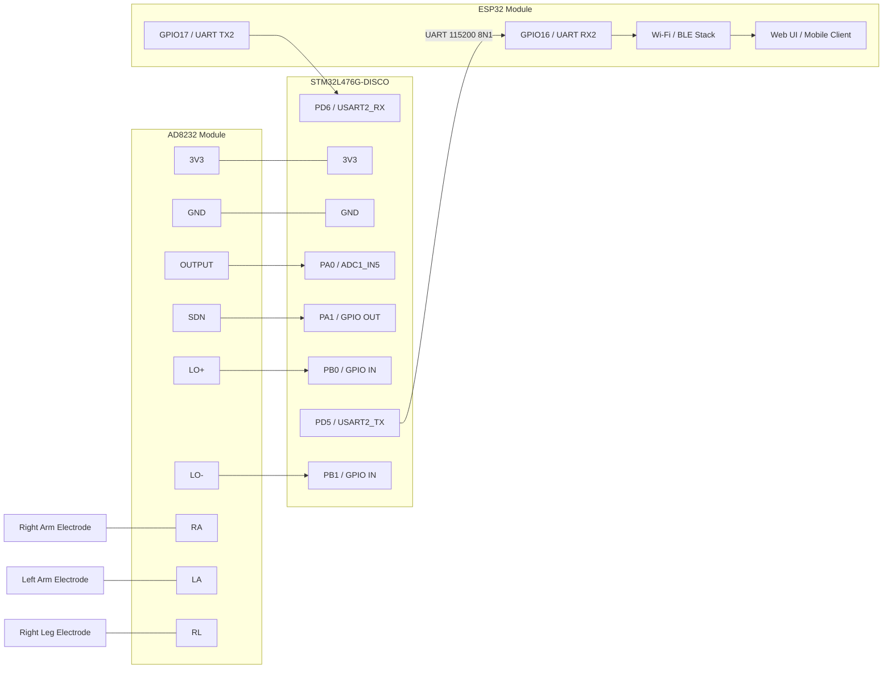

# ECG Monitoring System (STM32L476G + ESP32 + AD8232)

[](/LICENSE)


An end-to-end ECG monitoring platform that combines a STM32L476G-DISCO board, an ESP32 module, and an AD8232 analog front end. The STM32 captures and pre-processes the ECG waveform, then streams the data to the ESP32 for wireless visualization and user interaction.

---

## System Overview

- **Analog Front End (AD8232)**: Conditions the biopotential captured by the electrodes and exposes a single-ended ECG waveform.
- **STM32L476G-DISCO**: Samples the conditioned ECG signal at 250 Hz using TIM6-triggered ADC conversions with DMA and pushes packets out over UART (115200 8N1). Optional lead-off detection (LO+/LO-) is supported.
- **ESP32 Module**: Receives the UART stream, provides Wi-Fi or BLE connectivity, hosts the web dashboard, and forwards data for storage or additional analytics.
- **Host Devices**: A laptop, phone, or tablet connects to the ESP32 to view live traces or retrieve stored sessions.

```
Electrodes -> AD8232 -> STM32L476G (ADC + DSP) -> UART -> ESP32 (Wi-Fi/BLE) -> Web UI or Client App
```

---

## Repository Layout

- `stm32L476g-ecg/` - STM32CubeIDE project implementing the ADC, filtering, and UART transport pipeline.
- `esp32-visualizer/` - PlatformIO project that exposes the captured ECG stream through Wi-Fi or BLE and renders the live waveform.

---

## Hardware Integration

### Bill of Materials

- STM32L476G-DISCO development board
- ESP32 development board (for example ESP32-WROOM-32 devkit)
- AD8232 ECG module with electrode leads
- Three single-lead ECG electrodes (RA, LA, RL)
- USB cables, Dupont jumpers, and a stable 3.3 V supply (if not powered by USB)
- Optional: Shielded cables, decoupling capacitors, enclosure

### Quick Wiring Reference (AD8232 <-> STM32L476G-DISCO)

| AD8232 pin       | STM32 pin                      | Function                     |
| ---------------- | ------------------------------ | ---------------------------- |
| 3V3              | 3V3                            | Power                        |
| GND              | GND                            | Reference ground             |
| OUTPUT           | **PA0 (ADC1_IN5)**             | ECG analog output            |
| SDN (active low) | **PA1 (GPIO OUT, drive HIGH)** | Enable or shutdown           |
| LO+              | **PB0 (GPIO IN)**              | Lead-off positive (optional) |
| LO-              | **PB1 (GPIO IN)**              | Lead-off negative (optional) |
| RA               | Electrode                      | Right arm                    |
| LA               | Electrode                      | Left arm                     |
| RL               | Electrode                      | Right leg (reference)        |

### STM32 <-> ESP32 UART Link

| Signal  | STM32 pin                             | ESP32 pin (example) | Notes                               |
| ------- | ------------------------------------- | ------------------- | ----------------------------------- |
| UART TX | PA2 (USART2_TX or PD5 on ST-Link VCP) | GPIO16 (RX2)        | Serial data from STM32              |
| UART RX | PA3 (USART2_RX or PD6 on ST-Link VCP) | GPIO17 (TX2)        | Optional for acknowledgements       |
| 3V3     | 3V3                                   | 3V3                 | Ensure current budget is sufficient |
| GND     | GND                                   | GND                 | Common ground, keep runs short      |

### Data Path Diagram



---

## Firmware

### STM32 Pipeline (`stm32L476g-ecg/`)

- Configured with STM32CubeMX (`L4-ECG.ioc`) to drive TIM6 as a trigger for ADC1 conversions at 250 Hz.
- Uses DMA to move 12-bit samples into a buffer with minimal CPU overhead.
- Optional digital filtering stage (high-pass or low-pass) to suppress baseline wander and mains noise.
- Packages ECG samples and status flags (lead-off, overflow) and streams them over USART2 (115200 baud).
- Provides hooks for future QRS detection or on-board heart rate computation.

### ESP32 Application (`esp32-visualizer/`)

- PlatformIO project targeting the ESP32 module.
- Initializes a UART interface that matches the STM32 baud rate and framing.
- Buffers incoming samples and forwards them to:
  - A Wi-Fi access point hosting a web dashboard (WebSocket plus Canvas graphing), or
  - BLE characteristics for mobile app consumption.
- Manages configuration (sampling window, scaling, offsets) and optional data logging.
- Extensible to publish data to MQTT or cloud endpoints or to store to SD card if hardware is available.

---

## Getting Started

1. **Assemble the hardware**

   - Attach electrodes (RA, LA, RL) to the subject.
   - Double-check the AD8232 wiring to the STM32 and the UART link to the ESP32.
   - Power the system from a stable 3.3 V source (USB for development is acceptable).

2. **Build and flash the STM32 firmware**

   - Open `stm32L476g-ecg/L4-ECG.ioc` in STM32CubeIDE.
   - Generate code if required, then build the project.
   - Connect the STM32L476G-DISCO via USB and flash the binary.
   - Use the integrated virtual COM port to verify UART output with a serial console.

3. **Build and flash the ESP32 firmware**

   - Install PlatformIO if not already available.
   - From `esp32-visualizer/`, run `pio run` to build and `pio run -t upload` to flash.
   - Monitor serial output (`pio device monitor`) to confirm sample reception.

4. **Visualize the ECG**
   - Join the ESP32-hosted Wi-Fi network or connect via BLE.
   - Open the provided web interface to view live traces; adjust gain and time scale as needed.
   - Optionally record sessions or forward data to external analytics tools.

---

## Troubleshooting

- **No ECG waveform**: Confirm electrode placement, ensure the AD8232 SDN pin is held HIGH, and check that the STM32 ADC is sampling (TIM6 counter running).
- **High noise or baseline drift**: Verify common ground between modules, shorten analog wiring, and review filter coefficients.
- **UART framing errors**: Make sure both MCUs share 115200 8N1 settings and have a solid ground reference.
- **ESP32 network unavailable**: Re-flash the ESP32 firmware or monitor the console for Wi-Fi or BLE initialization messages.
- **Power instability**: Measure the 3.3 V rail under load; add decoupling capacitors close to the AD8232 and MCU supply pins.

---

## Future Enhancements

- Implement QRS detection and heart rate estimation directly on the STM32 or ESP32.
- Add persistent storage (SD card or cloud sync) for long-term ECG logging.
- Extend the web dashboard with multi-lead overlays, annotation tools, and analytics.
- Integrate battery management and low-power modes for wearable deployments.
- Provide mobile apps that consume the BLE service for offline usage.

---

## Credits

- **Author**: Victor Quilgars
- **Contact**: vquilgars@icloud.com
- **License**: MIT License (see `/LICENSE` if present)

Feel free to open issues or submit pull requests to improve the hardware design, firmware, or visualization experience.
